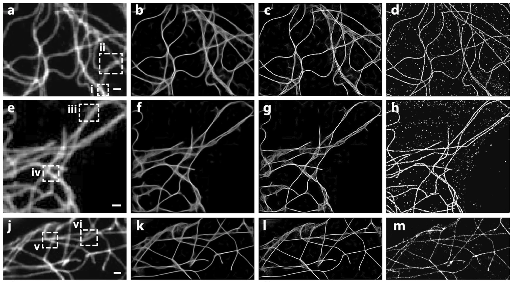

---

##### Download

+ [Paper](https://www.nature.com/articles/s41598-018-24033-7.pdf)
+ [Online appendix](https://static-content.springer.com/esm/art%3A10.1038%2Fs41598-018-24033-7/MediaObjects/41598_2018_24033_MOESM1_ESM.pdf)

---

##### Abstract

Capturing biological dynamics with high spatiotemporal resolution demands the advancement in imaging technologies. Super-resolution fluorescence microscopy offers spatial resolution surpassing the diffraction limit to resolve near-molecular-level details. While various strategies have been reported to improve the temporal resolution of super-resolution imaging, all super-resolution techniques are still fundamentally limited by the trade-off associated with the longer image acquisition time that is needed to achieve higher spatial information. Here, we demonstrated an example-based, computational method that aims to obtain super-resolution images using conventional imaging without increasing the imaging time. With a low-resolution image input, the method provides an estimate of its super-resolution image based on an example database that contains super- and low-resolution image pairs of biological structures of interest. The computational imaging of cellular microtubules agrees approximately with the experimental super-resolution STORM results. This new approach may offer potential improvements in temporal resolution for experimental super-resolution fluorescence microscopy and provide a new path for large-data aided biomedical imaging.

---

##### Figure X: Figure caption



---

##### Citation

```BibTeX
@article{article,
author = {Jia, Shu and Han, Boran and Kutz, J},
year = {2018},
month = {04},
pages = {5700},
title = {Example-Based Super-Resolution Fluorescence Microscopy},
volume = {8},
journal = {Scientific reports},
}
```

---

##### Related material

+ [Presentation slides](presentation2.pdf)

