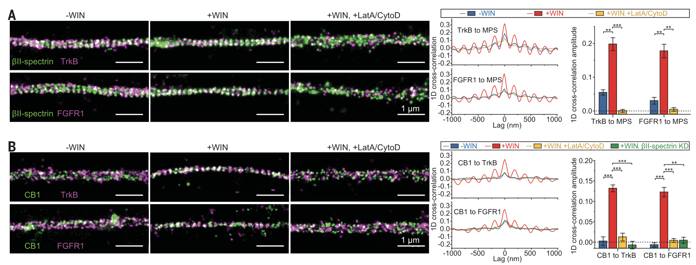

---

##### Download

+ [Paper](https://www.science.org/doi/full/10.1126/science.aaw5937)
+ [Online appendix](https://www.science.org/doi/suppl/10.1126/science.aaw5937/suppl_file/aaw5937_zhou_sm.pdf)

---

##### Abstract

Actin, spectrin, and related molecules form a membrane-associated periodic skeleton (MPS) in neurons. The function of the MPS, however, remains poorly understood. Using super-resolution imaging, we observed that G protein–coupled receptors (GPCRs), cell adhesion molecules (CAMs), receptor tyrosine kinases (RTKs), and related signaling molecules were recruited to the MPS in response to extracellular stimuli, resulting in colocalization of these molecules and RTK transactivation by GPCRs and CAMs, giving rise to extracellular signal–regulated kinase (ERK) signaling. Disruption of the MPS prevented such molecular colocalizations and downstream ERK signaling. ERK signaling in turn caused calpain-dependent MPS degradation, providing a negative feedback that modulates signaling strength. These results reveal an important functional role of the MPS and establish it as a dynamically regulated platform for GPCR- and CAM-mediated RTK signaling.

---

##### Figure X: Figure caption



---

##### Citation

```BibTeX
@article{
doi:10.1126/science.aaw5937,
author = {Ruobo Zhou  and Boran Han  and Chenglong Xia  and Xiaowei Zhuang },
title = {Membrane-associated periodic skeleton is a signaling platform for RTK transactivation in neurons},
journal = {Science},
volume = {365},
number = {6456},
pages = {929-934},
year = {2019},
doi = {10.1126/science.aaw5937},
URL = {https://www.science.org/doi/abs/10.1126/science.aaw5937},
eprint = {https://www.science.org/doi/pdf/10.1126/science.aaw5937},
}


```

---

