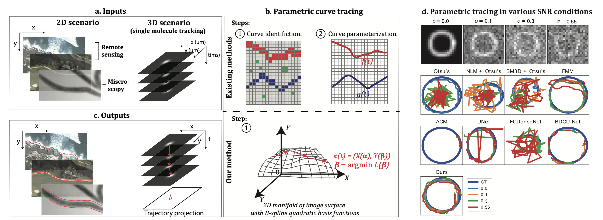

---

##### Download

+ [Paper](https://openaccess.thecvf.com/content/ICCV2021W/TradiCV/papers/Han_A_Robust_End-to-End_Method_for_Parametric_Curve_Tracing_via_Soft_ICCVW_2021_paper.pdf)
+ [Online appendix](https://openaccess.thecvf.com/content/ICCV2021W/TradiCV/supplemental/Han_A_Robust_End-to-End_ICCVW_2021_supplemental.pdf)

---

##### Abstract

Parametric curve tracing enables wide applications, such as lane following in autonomous driving, volumetric reconstruction in seismic, single-molecule/protein tracking in microscopy. Most existing parametric curve tracing methods require several steps, including curve identification and parameterization. Such multi-step methods can lead to lengthy and complicated parameter optimization. Additionally, the performance of curve identification methods can be degraded by noisy or low-light images. To address these challenges, we present a novel single-step approach to trace curves parametrically via optimizing a self-defined non-linear objective function that describes several key properties of the curve. Under the assumption that signals along the curve resemble each other, our objective function will guide this pathfinding process from a seed point along the direction according to maximum cosine similarity. No pre- and post-processing step is required to measure the tangent or normal vectors. We visualize our objective function and conduct several numerical experiments. These empirical experiments demonstrate that our method outperforms other competing methods across image domains. It yields better accuracy even in low signal-to-noise ratio (SNR) conditions. 

---

##### Figure X: Figure caption



---

##### Citation


```BibTeX
@InProceedings{Han_2021_ICCV,
    author    = {Han, Boran and Vila, Jeremy},
    title     = {A Robust End-to-End Method for Parametric Curve Tracing via Soft Cosine-Similarity-Based Objective Function},
    booktitle = {Proceedings of the IEEE/CVF International Conference on Computer Vision (ICCV) Workshops},
    month     = {October},
    year      = {2021},
    pages     = {2453-2463}
}
```

---

##### Related material

+ [Presentation slides](presentation2.pdf)

