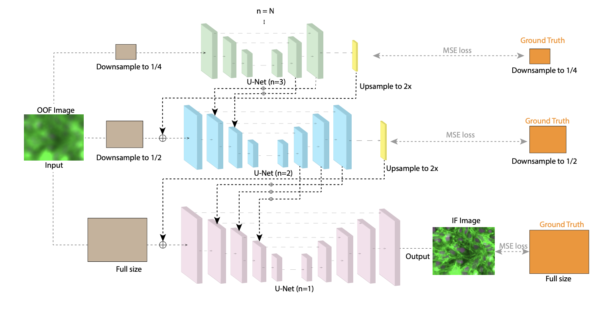

---

##### Download

+ [Paper](https://ieeexplore.ieee.org/abstract/document/9897168)

---

##### Abstract

Microscopy imaging is vital in biology research and diagnosis. When imaging at the scale of cell or molecule level, mechanical drift on the axial axis can be difficult to correct. Although multi-scale networks have been developed for de-blurring, those cascade residual learning approaches fail to accurately capture the end-to-end non-linearity of deconvolution, a relation between in-focus images and their out-of-focus counterparts in microscopy. In our model, we adopt a structure of multi-scale U-Net without cascade residual leaning. Additionally, in contrast to the conventional coarse-to-fine model, our model strengthens the cross-scale interaction by fusing the features from the coarser sub-networks with the finer ones in a head-to-tail manner: the decoder from the coarser scale is fused with the encoder of the finer ones. Such interaction contributes to better feature learning as fusion happens across decoder and encoder at all scales. Numerous experiments demonstrate that our method yields better performance when compared with other existing models.

---

##### Figure X: Figure caption



---

##### Citation

```BibTeX
@INPROCEEDINGS{9897168,
  author={Wang, Jiahe and Han, Boran},
  booktitle={2022 IEEE International Conference on Image Processing (ICIP)}, 
  title={Defocus Deblur Microscopy via Head-to-Tail Cross-Scale Fusion}, 
  year={2022},
  volume={},
  number={},
  pages={2081-2086},
  doi={10.1109/ICIP46576.2022.9897168}}

```

---

