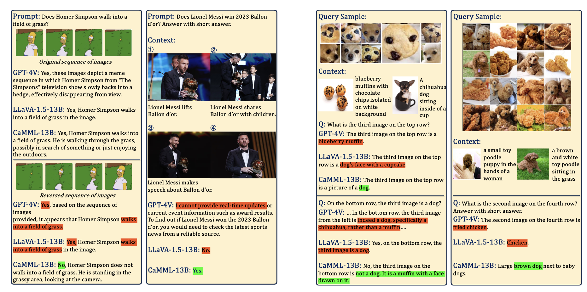

---

##### Download

+ [Paper](https://arxiv.org/abs/2307.10422)
+ [Online appendix](https://arxiv.org/abs/2307.10422)
+ [Code and data](https://arxiv.org/abs/2307.10422)

---

##### Abstract

In this work, we introduce Context-Aware MultiModal Learner (CaMML), for tuning large multimodal models (LMMs). CaMML, a lightweight module, is crafted to seamlessly integrate multimodal contextual samples into large models, thereby empowering the model to derive knowledge from analogous, domain-specific, up-to-date information and make grounded inferences. Importantly,CaMML is highly scalable and can efficiently handle lengthy multimodal context examples owing to its hierarchical design. Based on CaMML, we have developed two multimodal models, CaMML-7B and CaMML-13B, that have shown exceptional performance across an array of benchmark datasets for multimodal tasks. Remarkably, CaMML-13B achieves the state-of-the-art performance on over ten widely recognized multimodal benchmark datasets, surpassing LLaVA-1.5 (13B) with a noticeable margin, without integration of any external resources. Moreover, we have conducted extensive ablative studies to inspect the inner workings of CaMML and performed qualitative analyses to showcase its effectiveness in handling real-world challenging cases.

---

##### Figure X: Figure caption



---

##### Citation


```BibTeX
@article{AAYY,
author = {Author 1 and Author 2},
doi = {paper_doi},
journal = {Journal},
number = {Issue},
pages = {XXX--YYY},
title ={Title},
volume = {Volume},
year = {Year}}
```

---


