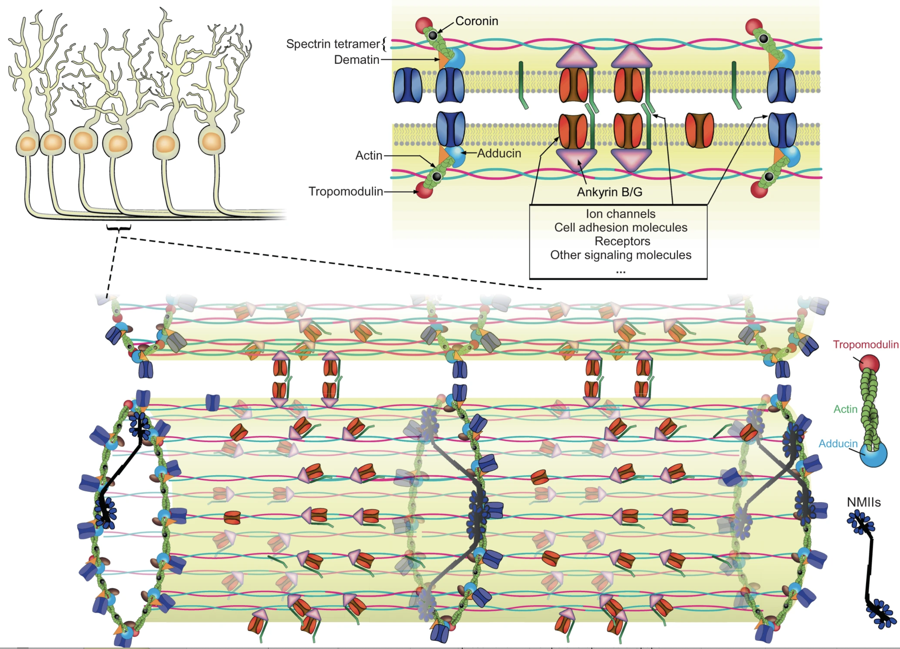

---

##### Download

+ [Paper](https://www.nature.com/articles/s41467-022-30720-x)
+ [Online appendix](https://www.nature.com/articles/s41467-022-30720-x#Sec26)
+ [Code and data](https://doi.org/10.5281/zenodo.3264857)

---

##### Abstract

Actin, spectrin, and associated molecules form a membrane-associated periodic skeleton (MPS) in neurons. The molecular composition and functions of the MPS remain incompletely understood. Here, using co-immunoprecipitation and mass spectrometry, we identified hundreds of potential candidate MPS-interacting proteins that span diverse functional categories. We examined representative proteins in several of these categories using super-resolution imaging, including previously unknown MPS structural components, as well as motor proteins, cell adhesion molecules, ion channels, and signaling proteins, and observed periodic distributions characteristic of the MPS along the neurites for ~20 proteins. Genetic perturbations of the MPS and its interacting proteins further suggested functional roles of the MPS in axon-axon and axon-dendrite interactions and in axon diameter regulation, and implicated the involvement of MPS interactions with cell adhesion molecules and non-muscle myosin in these roles. These results provide insights into the interactome of the MPS and suggest previously unknown functions of the MPS in neurons.

---

##### Figure X: Figure caption



---

##### Citation

```BibTeX
@article{unknown,
author = {Zhou, Ruobo and Han, Boran and Nowak, Roberta and Lu, Yunzhe and Heller, Evan and Xia, Chenglong and Chishti, Athar and Fowler, Velia and Zhuang, Xiaowei},
year = {2022},
month = {2},
pages = {},
journal = {Nature Communications},
title = {Proteomic and functional analyses of the periodic membrane skeleton in neurons},
}
```

---

