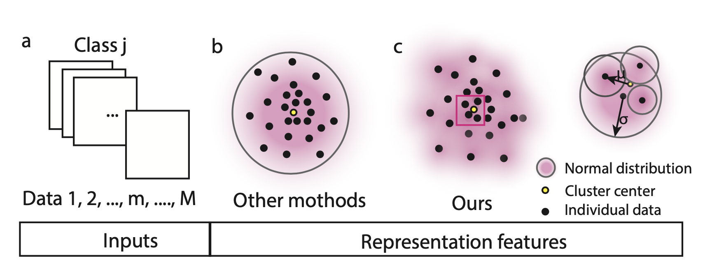

---

##### Download

+ [Paper](https://dl.acm.org/doi/10.5555/3618408.3618908)
+ [Online appendix](https://dl.acm.org/doi/10.5555/3618408.3618908)
+ [Code and data](https://github.com/boranhan/wcdas_code)

---

##### Abstract

Addressing imbalanced or long-tailed data is a major challenge in visual recognition tasks due to disparities between training and testing distributions and issues with data noise. We propose the Wrapped Cauchy Distributed Angular Softmax (WCDAS), a novel softmax function that incorporates data-wise Gaussian-based kernels into the angular correlation between feature representations and classifier weights, effectively mitigating noise and sparse sampling concerns. The class-wise distribution of angular representation becomes a sum of these kernels. Our theoretical analysis reveals that the wrapped Cauchy distribution excels the Gaussian distribution in approximating mixed distributions. Additionally, WCDAS uses trainable concentration parameters to dynamically adjust the compactness and margin of each class. Empirical results confirm label-aware behavior in these parameters and demonstrate WCDAS's superiority over other state-of-the-art softmax-based methods in handling long-tailed visual recognition across multiple benchmark datasets. The code is public available. 

---

##### Figure X: Figure caption



---

##### Citation

Author 1 and Author 2. Year. "Title." *Journal* Volume (Issue): First page–Last page. https://doi.org/paper_doi.

```BibTeX
@article{AAYY,
@inproceedings{10.5555/3618408.3618908,
author = {Han, Boran},
title = {Wrapped Cauchy Distributed Angular Softmax for Long-Tailed Visual Recognition},
year = {2023},
publisher = {JMLR.org},
booktitle = {Proceedings of the 40th International Conference on Machine Learning},
articleno = {500},
numpages = {21},
location = {Honolulu, Hawaii, USA},
series = {ICML'23}
}


```

---
