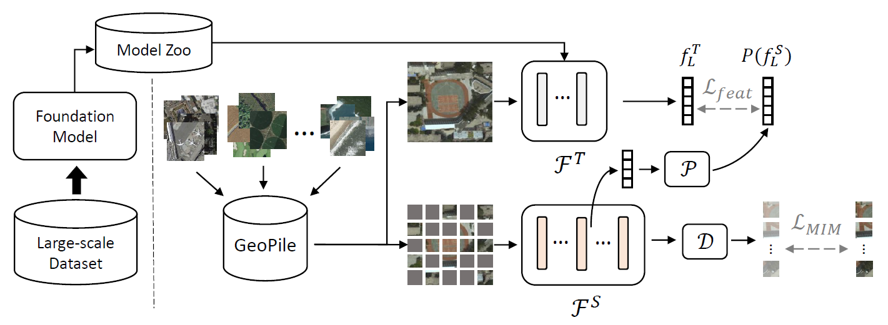

---

##### Download

+ [Paper](https://openaccess.thecvf.com/content/ICCV2023/papers/Mendieta_Towards_Geospatial_Foundation_Models_via_Continual_Pretraining_ICCV_2023_paper.pdf)
+ [Online appendix](https://openaccess.thecvf.com/content/ICCV2023/supplemental/Mendieta_Towards_Geospatial_Foundation_ICCV_2023_supplemental.pdf)
+ [Code and data](https://github.com/mmendiet/gfm)

---

##### Abstract

Geospatial technologies are becoming increasingly essential in our world for a wide range of applications, including agriculture, urban planning, and disaster response. To help improve the applicability and performance of deep learning models on these geospatial tasks, various works have begun investigating foundation models for this domain. Researchers have explored two prominent approaches for introducing such models in geospatial applications, but both have drawbacks in terms of limited performance benefit or prohibitive training cost. Therefore, in this work, we propose a novel paradigm for building highly effective geospatial foundation models with minimal resource cost and carbon impact. We first construct a compact yet diverse dataset from multiple sources to promote feature diversity, which we term GeoPile. Then, we investigate the potential of continual pretraining from large-scale ImageNet-22k models and propose a multi-objective continual pretraining paradigm, which leverages the strong representations of ImageNet while simultaneously providing the freedom to learn valuable in-domain features. Our approach outperforms previous state-of-the-art geospatial pretraining methods in an extensive evaluation on seven downstream datasets covering various tasks such as change detection, classification, multi-label classification, semantic segmentation, and super-resolution. Code is available at https://github.com/mmendiet/GFM. 

---

##### Figure X: Figure caption



---

##### Citation

```BibTeX
@InProceedings{Mendieta_2023_ICCV,
    author    = {Mendieta, Mat{\'\i}as and Han, Boran and Shi, Xingjian and Zhu, Yi and Chen, Chen},
    title     = {Towards Geospatial Foundation Models via Continual Pretraining},
    booktitle = {Proceedings of the IEEE/CVF International Conference on Computer Vision (ICCV)},
    month     = {October},
    year      = {2023},
    pages     = {16806-16816}
}
```

---

##### Related material

+ [Presentation slides](GFM_presentation-1.pdf)
