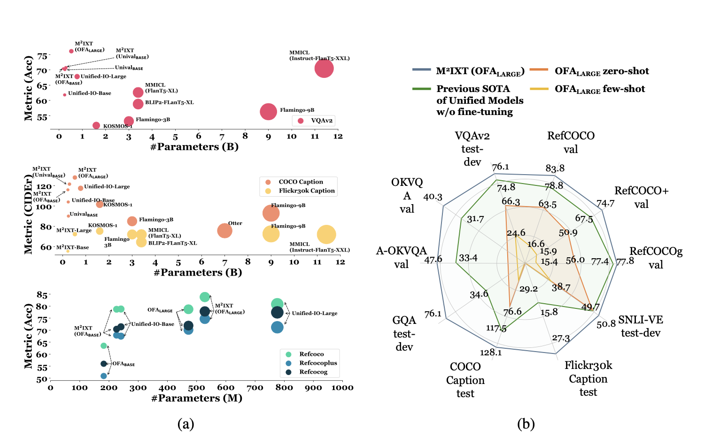

---

##### Download

+ [Paper](https://arxiv.org/abs/2310.05109)
+ [Online appendix](https://arxiv.org/abs/2310.05109)

---

##### Abstract

In-context learning (ICL) involves reasoning from given contextual examples. As more modalities comes, this procedure is becoming more challenging as the interleaved input modalities convolutes the understanding process. This is exemplified by the observation that multimodal models often struggle to effectively extrapolate from contextual examples to perform ICL. To address these challenges, we introduce MultiModal In-conteXt Tuning (M2IXT), a lightweight module to enhance the ICL capabilities of multimodal unified models. The proposed M2IXT module perceives an expandable context window to incorporate various labeled examples of multiple modalities (e.g., text, image, and coordinates). It can be prepended to various multimodal unified models (e.g., OFA, Unival, LLaVA) of different architectures and trained via a mixed-tasks strategy to enable rapid few-shot adaption on multiple tasks and datasets. When tuned on as little as 50K multimodal data, M2IXT can boost the few-shot ICL performance significantly (e.g., 18\% relative increase for OFA), and obtained state-of-the-art results across an array of tasks including visual question answering, image captioning, visual grounding, and visual entailment, while being considerably small in terms of model parameters (e.g., ∼20× smaller than Flamingo or MMICL), highlighting the flexibility and effectiveness of M2IXT as a multimodal in-context learner. 

---

##### Figure X: Figure caption



---

##### Citation

```BibTeX
@misc{chen2023lightweight,
      title={Lightweight In-Context Tuning for Multimodal Unified Models}, 
      author={Yixin Chen and Shuai Zhang and Boran Han and Jiaya Jia},
      year={2023},
      eprint={2310.05109},
      archivePrefix={arXiv},
      primaryClass={cs.CV}
}
```

---

