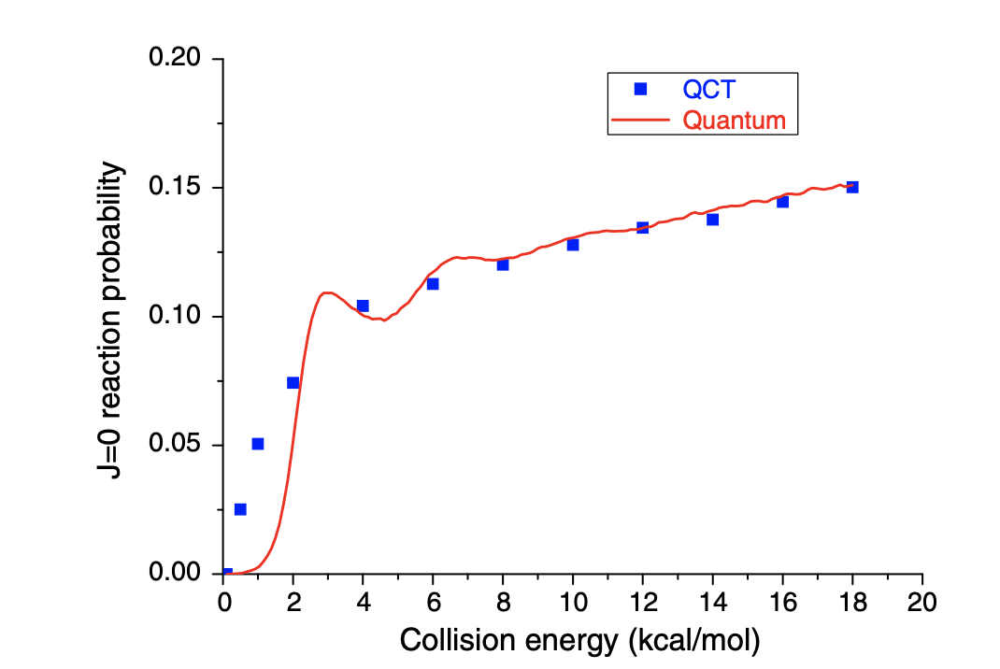

---

##### Download

+ [Paper](https://www.sciencedirect.com/science/article/abs/pii/S000926141000713X)

---

##### Abstract

Using a highly accurate potential energy surface reported by Poveda and Varandas for the quartet state of NH2, we have applied the quasi-classical trajectory and quantum mechanical methods to calculate reaction probabilities for the title reaction at zero total angular momentum. The total reaction cross section and product rotational alignment have also been calculated for the ground vibrational–rotational state of the reactants. The specific vibrational–rotational rate constant shows an Arrhenius-type behavior over the investigated temperature range of 200–2500 K, in unprecedentedly good agreement with the experimental data available.

---

##### Figure X: Figure caption



---

##### Citation


```BibTeX
@article{HAN2010225,
title = {Quasi-classical trajectory and quantum mechanics study of the reaction H(2S)+NH→N(4S)+H2},
journal = {Chemical Physics Letters},
volume = {493},
number = {4},
pages = {225-228},
year = {2010},
issn = {0009-2614},
doi = {https://doi.org/10.1016/j.cplett.2010.05.049},
url = {https://www.sciencedirect.com/science/article/pii/S000926141000713X},
author = {Boran Han and Huan Yang and Yujun Zheng and António J.C. Varandas}
}
```

---
