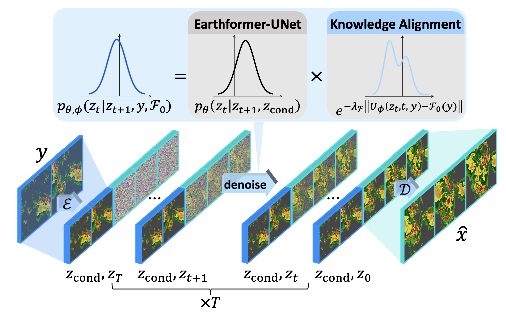

---

##### Download

+ [Paper](https://arxiv.org/abs/2307.10422)
+ [Online appendix](https://arxiv.org/abs/2307.10422)
+ [Code and data](https://github.com/gaozhihan/PreDiff)

---

##### Abstract

Earth system forecasting has traditionally relied on complex physical models that are computationally expensive and require significant domain expertise. In the past decade, the unprecedented increase in spatiotemporal Earth observation data has enabled data-driven forecasting models using deep learning techniques. These models have shown promise for diverse Earth system forecasting tasks but either struggle with handling uncertainty or neglect domain-specific prior knowledge, resulting in averaging possible futures to blurred forecasts or generating physically implausible predictions. To address these limitations, we propose a two-stage pipeline for probabilistic spatiotemporal forecasting: 1) We develop PreDiff, a conditional latent diffusion model capable of probabilistic forecasts. 2) We incorporate an explicit knowledge alignment mechanism to align forecasts with domain-specific physical constraints. This is achieved by estimating the deviation from imposed constraints at each denoising step and adjusting the transition distribution accordingly. We conduct empirical studies on two datasets: N-body MNIST, a synthetic dataset with chaotic behavior, and SEVIR, a real-world precipitation nowcasting dataset. Specifically, we impose the law of conservation of energy in N-body MNIST and anticipated precipitation intensity in SEVIR. Experiments demonstrate the effectiveness of PreDiff in handling uncertainty, incorporating domain-specific prior knowledge, and generating forecasts that exhibit high operational utility. 

---

##### Figure X: Figure caption



---

##### Citation


```BibTeX
@inproceedings{
gao2023prediff,
title={PreDiff: Precipitation Nowcasting with Latent Diffusion Models},
author={Zhihan Gao and Xingjian Shi and Boran Han and Hao Wang and Xiaoyong Jin and Danielle C. Maddix and Yi Zhu and Mu Li and Bernie Wang},
booktitle={Thirty-seventh Conference on Neural Information Processing Systems},
year={2023},
url={https://openreview.net/forum?id=Gh67ZZ6zkS}
}
```

---

##### Related material

+ [Presentation slides](https://nips.cc/virtual/2023/poster/72200)

