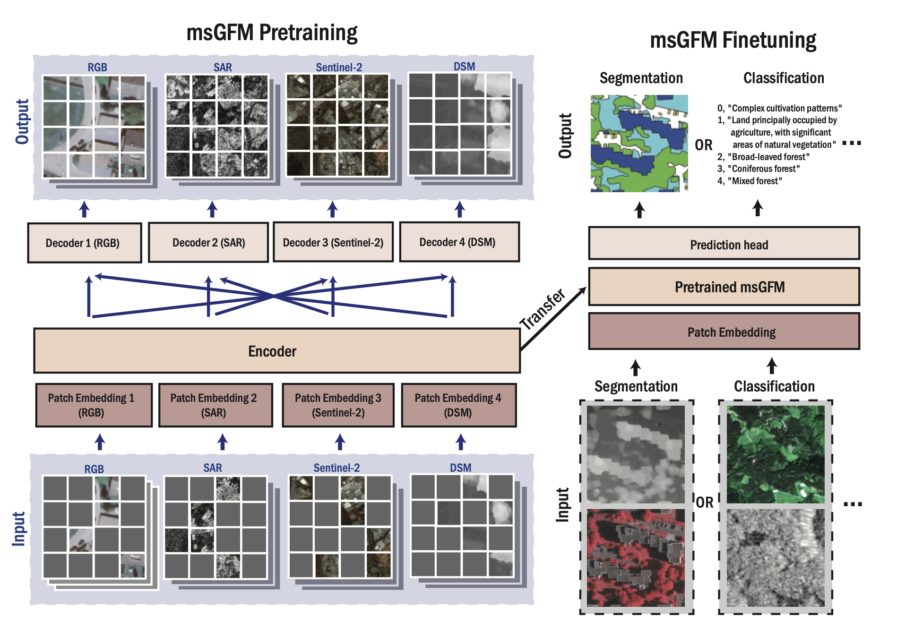

---

##### Download

+ [Paper](https://arxiv.org/abs/2404.01260)
+ [Code and data](https://github.com/boranhan/Geospatial_Foundation_Models)

---

##### Abstract

In the realm of geospatial analysis, the diversity of remote sensors, encompassing both optical and microwave technologies, offers a wealth of distinct observational capabilities. Recognizing this, we present msGFM, a multisensor geospatial foundation model that effectively unifies data from four key sensor modalities. This integration spans an expansive dataset of two million multisensor images. msGFM is uniquely adept at handling both paired and unpaired sensor data. For data originating from identical geolocations, our model employs an innovative cross-sensor pretraining approach in masked image modeling, enabling the synthesis of joint representations from diverse sensors. msGFM, incorporating four remote sensors, upholds strong performance, forming a comprehensive model adaptable to various sensor types. msGFM has demonstrated enhanced proficiency in a range of both single-sensor and multisensor downstream tasks. These include scene classification, segmentation, cloud removal, and pan-sharpening. A key discovery of our research is that representations derived from natural images are not always compatible with the distinct characteristics of geospatial remote sensors, underscoring the limitations of existing representations in this field. Our work can serve as a guide for developing multisensor geospatial pretraining models, paving the way for more advanced geospatial capabilities. 

---

##### Figure X: Figure caption



---

##### Citation


```BibTeX
@misc{han2024bridging,
      title={Bridging Remote Sensors with Multisensor Geospatial Foundation Models}, 
      author={Boran Han and Shuai Zhang and Xingjian Shi and Markus Reichstein},
      year={2024},
      eprint={2404.01260},
      archivePrefix={arXiv},
      primaryClass={cs.CV}
}
```

---


