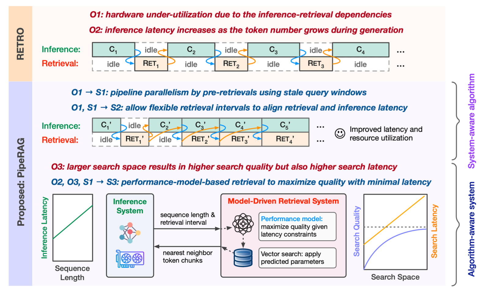

---

##### Download

+ [Paper](https://arxiv.org/abs/2403.05676)

---

##### Abstract

Retrieval-augmented generation (RAG) can enhance the generation quality of large language models (LLMs) by incorporating external token databases. However, retrievals from large databases can constitute a substantial portion of the overall generation time, particularly when retrievals are periodically performed to align the retrieved content with the latest states of generation. In this paper, we introduce PipeRAG, a novel algorithm-system co-design approach to reduce generation latency and enhance generation quality. PipeRAG integrates (1) pipeline parallelism to enable concurrent retrieval and generation processes, (2) flexible retrieval intervals to maximize the efficiency of pipeline parallelism, and (3) a performance model to automatically balance retrieval quality and latency based on the generation states and underlying hardware. Our evaluation shows that, by combining the three aforementioned methods, PipeRAG achieves up to 2.6× speedup in end-to-end generation latency while improving generation quality. These promising results showcase the effectiveness of co-designing algorithms with underlying systems, paving the way for the adoption of PipeRAG in future RAG systems. 

---

##### Figure X: Figure caption



---

##### Citation


```BibTeX
@misc{jiang2024piperag,
      title={PipeRAG: Fast Retrieval-Augmented Generation via Algorithm-System Co-design}, 
      author={Wenqi Jiang and Shuai Zhang and Boran Han and Jie Wang and Bernie Wang and Tim Kraska},
      year={2024},
      eprint={2403.05676},
      archivePrefix={arXiv},
      primaryClass={cs.CL}
}
```

---
