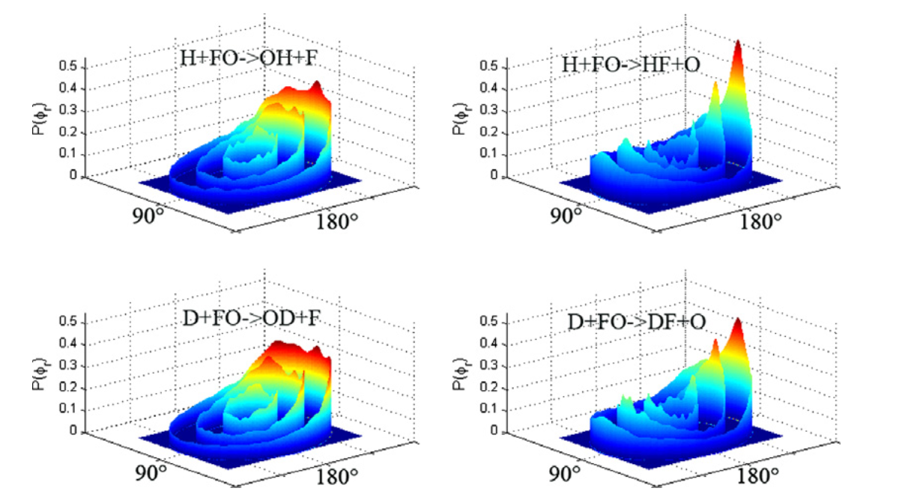

---

##### Download

+ [Paper](https://www.sciencedirect.com/science/article/abs/pii/S030101041000296X)

---

##### Abstract

The quasi-classical trajectory calculations are carried out for the title reactions on a recent-developed accurate potential energy surface of the triplet 13A″ state to gain insight into the alignment and the orientation of the product molecules. The three angular distributions, P(θr), P(Φr) and P(θr,Φr) with θr, Φr being the polar angles of the product angular momentum, and the four commonly-used polarization-dependent differential cross sections, dσ00/dωt, dσ20/dωt, dσ22+/dωt and dσ21−/dωt with ωt being the polar coordinates of the product velocity ω′, are calculated in the center-of-mass frame. Influences of the collision energy and of the isotope mass on the product polarization are shown and discussed.

---

##### Figure X: Figure caption



---

##### Citation

```BibTeX
@article{HAN201094,
title = {Product polarization on the 3A″ electronic state in the H+FO reaction and its isotope variant},
journal = {Chemical Physics},
volume = {374},
number = {1},
pages = {94-98},
year = {2010},
issn = {0301-0104},
doi = {https://doi.org/10.1016/j.chemphys.2010.06.028},
url = {https://www.sciencedirect.com/science/article/pii/S030101041000296X},
author = {Boran Han and Fujian Zong and Chunlei Wang and Wanyong Ma and Jianhua Zhou},
keywords = {Product polarization, Stereodynamics, QCT, Alignment}
}
```

---

