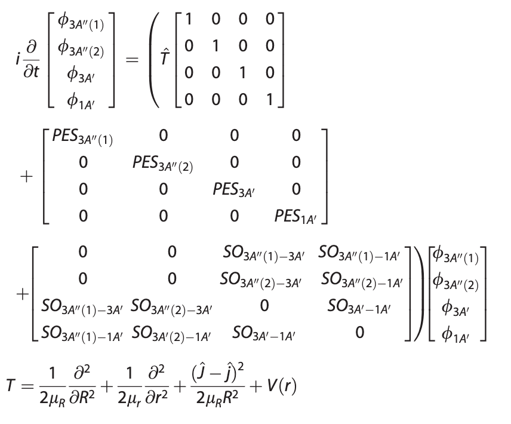

---

##### Download

+ [Paper](https://onlinelibrary.wiley.com/doi/abs/10.1002/jcc.21940)


---

##### Abstract

To investigate the extent of nonadiabatic effects in the title reaction, quasi-classical trajectory and nonadiabatic quantum scattering as well as the nonadiabatic quantum-classical trajectory calculations were performed on the accurate ab initio benchmark potential energy surfaces of the lowest 3A′ and 3A″ electronic states, together with the spin-orbit coupling matrix and the lowest singlet 1A′ potential energy surface. Comparison of the calculated total cross sections from both adiabatic and nonadiabatic calculations has demonstrated that for adiabatic channels including 3A′→3A′ and 3A″→3A″, difference does exist between the two kinds of adiabatic and nonadiabatic calculations, showing nonadiabatic effects to some extent. Such nonadiabatic effects tend to become more conspicuous at high collision energies and are found to be more pronounced with trajectories/quantum wave packet initiated on 3A′ than on 3A″. Furthermore, the present study also showed that nonadiabatic effects can bring the component of forward-scattering in the product angular distributions.

---

##### Figure X: Figure caption



---

##### Citation


```BibTeX
@article{https://doi.org/10.1002/jcc.21940,
author = {Han, Boran and Zheng, Yujun},
title = {Nonadiabatic quantum dynamics in O(3P)+H2→OH+H: A revisited study},
journal = {Journal of Computational Chemistry},
volume = {32},
number = {16},
pages = {3520-3525},
keywords = {nonadiabatic quantum dynamics, potential energy surfaces, cross section, quasiclassical trajectory},
doi = {https://doi.org/10.1002/jcc.21940},
url = {https://onlinelibrary.wiley.com/doi/abs/10.1002/jcc.21940},
eprint = {https://onlinelibrary.wiley.com/doi/pdf/10.1002/jcc.21940},
year = {2011}
}
```

---

##### Related material

+ [Presentation slides](presentation2.pdf)

