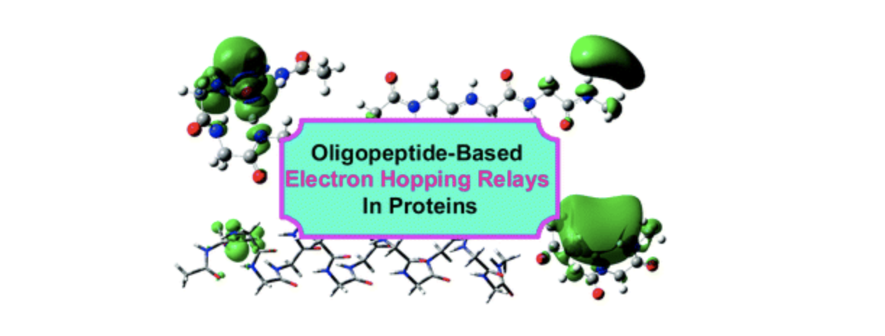

---

##### Download

+ [Paper](https://pubs.rsc.org/en/content/articlelanding/2012/cp/c2cp41566f/unauth)

---

##### Abstract

title: "This work presents a density functional theory calculational study for clarifying that peptide loops (–[peptide]n–) including the N-terminal and the C-terminal oligopeptides and the α-helix N-terminal can serve as an intriguing kind of relay elements, as an addition to the known relay stations served by aromatic amino acids for electron hopping migration. For these protein motifs, an excess electron generally prefers to reside at the –NH3+ group in a Rydberg state for the N-terminal peptides, or at the –COOH group in a dipole-bound state for the C-terminal peptides, and at the N-terminal in a dipole-bound π*-orbital state for the peptide loops and α-helices. The electron binding ability can be effectively enhanced by elongation for the α-helix N-terminal, and by bending, twisting, and even β-turning for the peptide chains. The relay property is determined by the local dipole instead of the total dipole of the peptide chains. Although no direct experiment supports this hypothesis, a series of recent studies regarding charge hopping migration associated with the peptide chains and helices could be viewed as strong evidence. But, further studies are still needed by considering the effects from relative redox potential between the donor and acceptor sites, protein environment, and structure water molecules." 


---

##### Figure X: Figure caption



---

##### Citation


```BibTeX
@Article{C2CP41566F,
author ="Han, Boran and Chen, Xiaohua and Zhao, Jing and Bu, Yuxiang",
title  ="A peptide loop and an α-helix N-terminal serving as alternative electron hopping relays in proteins",
journal  ="Phys. Chem. Chem. Phys.",
year  ="2012",
volume  ="14",
issue  ="45",
pages  ="15849-15859",
publisher  ="The Royal Society of Chemistry",
doi  ="10.1039/C2CP41566F",
url  ="http://dx.doi.org/10.1039/C2CP41566F"}
```

---

##### Related material

+ [Presentation slides](presentation2.pdf)

