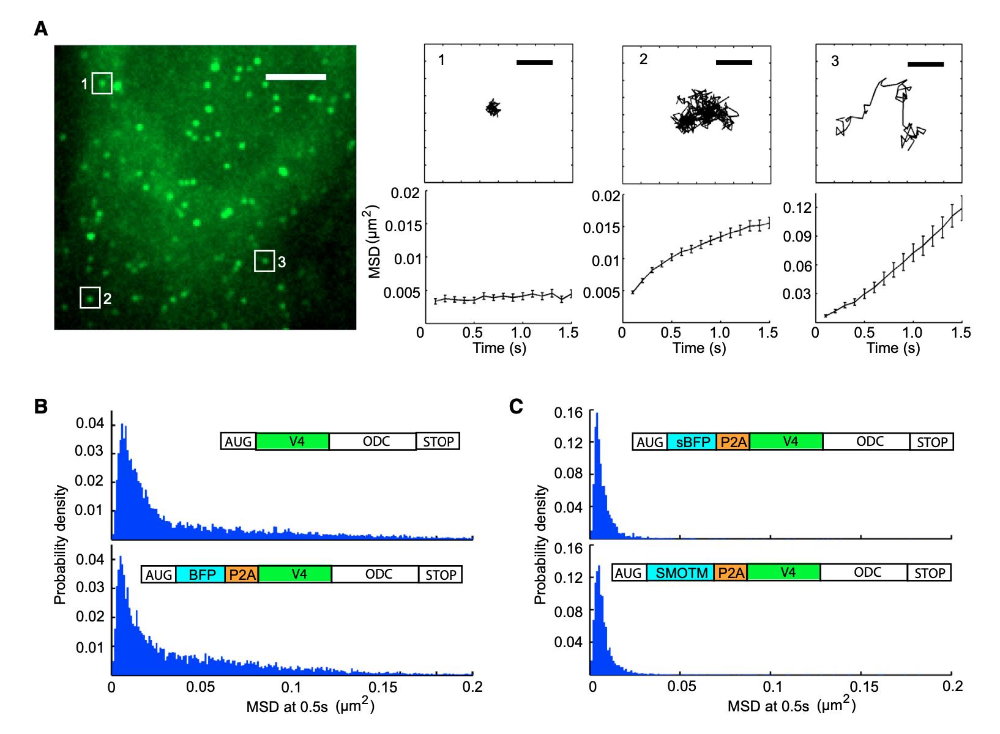

---

##### Download

+ [Paper](https://www.cell.com/cell/pdf/S0092-8674(16)30483-4.pdf)
+ [Online appendix](https://ars.els-cdn.com/content/image/1-s2.0-S0092867416304834-mmc1.pdf)

---

##### Abstract

Translation is under tight spatial and temporal controls to ensure protein production in the right time and place in cells. Methods that allow real-time, high-resolution visualization of translation in live cells are essential for understanding the spatiotemporal dynamics of translation regulation. Based on multivalent fluorescence amplification of the nascent polypeptide signal, we develop a method to image translation on individual mRNA molecules in real time in live cells, allowing direct visualization of translation events at the translation sites. Using this approach, we monitor transient changes of translation dynamics in responses to environmental stresses, capture distinct mobilities of individual polysomes in different subcellular compartments, and detect 3′ UTR-dependent local translation and active transport of polysomes in dendrites of primary neurons.

---

##### Figure X: Figure caption



---

##### Citation


```BibTeX
@article{WANG2016990,
title = {Real-Time Imaging of Translation on Single mRNA Transcripts in Live Cells},
journal = {Cell},
volume = {165},
number = {4},
pages = {990-1001},
year = {2016},
issn = {0092-8674},
author = {Chong Wang and Boran Han and Ruobo Zhou and Xiaowei Zhuang}
}
```

---

