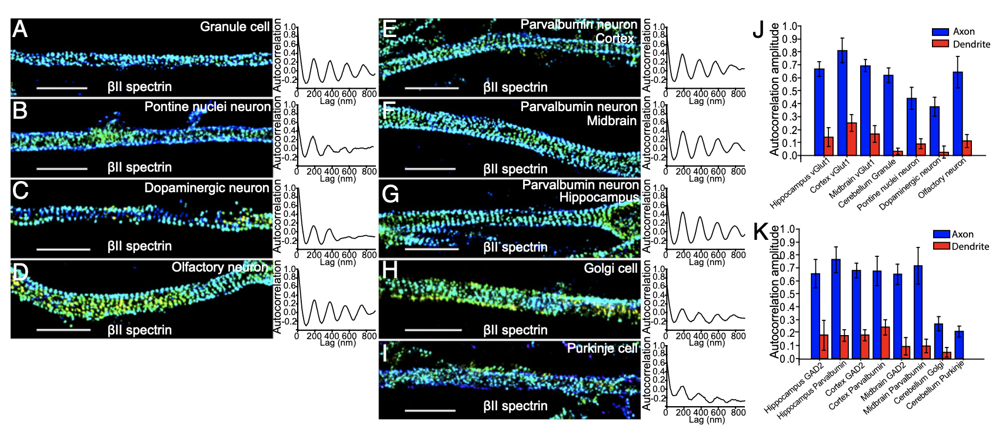

---

##### Download

+ [Paper](https://www.pnas.org/doi/epdf/10.1073/pnas.1605707113)
+ [Online appendix](https://www.pnas.org/doi/suppl/10.1073/pnas.1605707113/suppl_file/pnas.201605707si.pdf)

---

##### Abstract

Actin, spectrin, and associated molecules form a periodic, submembrane cytoskeleton in the axons of neurons. For a better understanding of this membrane-associated periodic skeleton (MPS), it is important to address how prevalent this structure is in different neuronal types, different subcellular compartments, and across different animal species. Here, we investigated the organization of spectrin in a variety of neuronal- and glial-cell types. We observed the presence of MPS in all of the tested neuronal types cultured from mouse central and peripheral nervous systems, including excitatory and inhibitory neurons from several brain regions, as well as sensory and motor neurons. Quantitative analyses show that MPS is preferentially formed in axons in all neuronal types tested here: Spectrin shows a long-range, periodic distribution throughout all axons but appears periodic only in a small fraction of dendrites, typically in the form of isolated patches in subregions of these dendrites. As in dendrites, we also observed patches of periodic spectrin structures in a small fraction of glial-cell processes in four types of glial cells cultured from rodent tissues. Interestingly, despite its strong presence in the axonal shaft, MPS is disrupted in most presynaptic boutons but is present in an appreciable fraction of dendritic spine necks, including some projecting from dendrites where such a periodic structure is not observed in the shaft. Finally, we found that spectrin is capable of adopting a similar periodic organization in neurons of a variety of animal species, including Caenorhabditis elegans, Drosophila, Gallus gallus, Mus musculus, and Homo sapiens.

---

##### Figure X: Figure caption



---

##### Citation
 

```BibTeX
@article{
doi:10.1073/pnas.1605707113,
author = {Jiang He  and Ruobo Zhou  and Zhuhao Wu  and Monica A. Carrasco  and Peri T. Kurshan  and Jonathan E. Farley  and David J. Simon  and Guiping Wang  and Boran Han  and Junjie Hao  and Evan Heller  and Marc R. Freeman  and Kang Shen  and Tom Maniatis  and Marc Tessier-Lavigne  and Xiaowei Zhuang },
title = {Prevalent presence of periodic actin–spectrin-based membrane skeleton in a broad range of neuronal cell types and animal species},
journal = {Proceedings of the National Academy of Sciences},
volume = {113},
number = {21},
pages = {6029-6034},
year = {2016},
doi = {10.1073/pnas.1605707113},
URL = {https://www.pnas.org/doi/abs/10.1073/pnas.1605707113},
eprint = {https://www.pnas.org/doi/pdf/10.1073/pnas.1605707113},}


```

---

